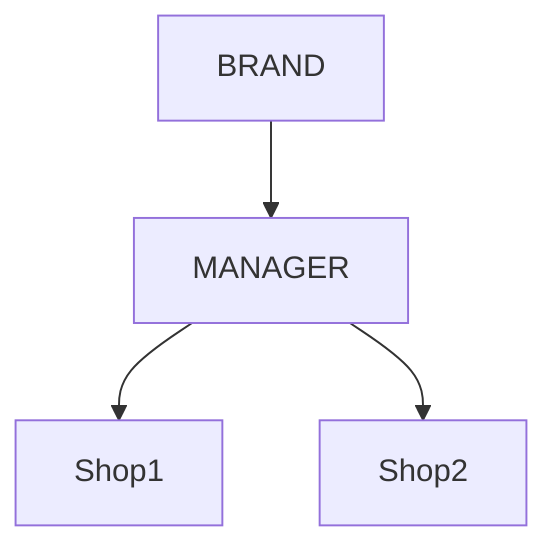
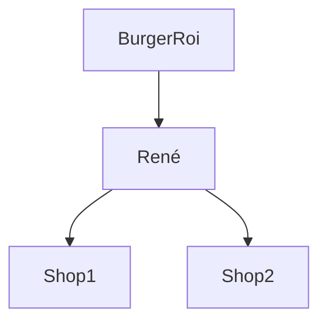

# Droits d'accès
----

Parmis tous les documents de la base de données, certains possèdent des droits d'accès particuliers. Pour ceux là, les requêtes peuvent renvoyer des résultats différents en fonction de l'utilisateur qui les formule.

## Rôles
----

Chaque utilisateur peut posséder l'un ou plusieurs de ces rôles :
1. `ROLE_ADMIN` : Administrateur système
1. `ROLE_USER` : Utilisateur lambda. Ce rôle est ajouté à tous les utilisateurs par defaut.
1. `ROLE_SHOP` : Utilisateur lié à une boutique unique.
1. `ROLE_MANAGER` : Utilisateur manager de plusieurs boutiques.
1. `ROLE_BRAND` : Utilisateur d'une entité marque.

Les documents utilisateurs peuvent également posséder un champs `brand` et un champs `manager`. Voir [User].

Par exemple :
- BurgerRoi est une marque de fastfoods. Ils ont un compte unique avec un rôle `ROLE_BRAND` qui leur permet d'avoir une vue sur tout les comptes liés à leur marque. 
- René ouvre un restaurant de la marque BurgerRoi, il dépend de la marque mais c'est lui qui gère son établissement. Il a un compte "renéshop@burgerroi.fr" avec un rôle `ROLE_SHOP` pour son restaurant. Son compte possède un champ `brand` qui référence le compte manager de BurgerRoi.
- Après quelques temps, René ouvre un second restaurant. Des responsables s'occupent de ses établissements, ils ont chacuns un compte. "renéshop@burgerroi.fr" et "renéshop-2@burgerroi.fr". Les deux comptes possèdent un champ `brand` qui référence le compte manager de BurgerRoi.
- Comme ses deux établissements utilisent beaucoup de recettes en commun, René se créer un compte manager avec son adresse personnelle. Son compte à le rôle `ROLE_MANAGER`. On ajoute à ses deux boutique le champs `manager` qui référence le compte manager de René.

----

Cette relation permets de gérer les données de façons déscendante. Chaques compte à accès à ses propres données, celles de son manager ainsi que celles de sa marque. Ainsi BurgerRoi peux créer une recette qui sera accessible à toutes ses boutiques afin que chaque établissement ne refasse pas le travail de création des recettes. De la même façons, le propriétaire de plusieurs boutiques peut créer des données depuis un seul compte afin qu'elles soient accessibles à toutes ses boutiques rapidement.

## Confidentialité
----

Certains documents possèdent un champs `privacy` qui permets de gérer son niveau de confidentialité. Il peut avoir l'une de ces valeurs :
1. PUBLIC : Le document est accessible à toute personne formulant une requête valide pour le lire.
1. FAMILY : Le document est accessible à son propriétaire ainsi qu'à tous ses descendants.
1. PRIVATE : Le document est uniquement accessible à son propriétaire.

{: .example }
> Le document "ABC" avec une `privacy` "FAMILY" d'une marque est accessible à son propriétaire ainsi qu'a tous les comptes "MANAGER" et "SHOP" qui référencent cette marque dans le champs `brand`.
>
> Le document "DEF" avec une `privacy` "FAMILY" d'un manager est accessible à son propriétaire ainsi qu'a tous les comptes "SHOP" qui référencent cet utilisateur dans le champs `manager`.

{: .note }
> Ces 3 règles de confidentialité accordent toujours des accès en lecture **uniquement**. L'écriture, la modification ou la suppression n'est toujours accessible qu'au propriétaire d'un document.

## Exemples
----

{: .request-get }
> https://api.sharlotte.fr/ingredients

La requête get-all permettant de récupérer la liste des ingrédients en base de données renvoie un résultat différent en fonction de l'auteur qui la formule.

> Anonyme : dans le cas d'une requête non authentifiée, la réponse renvoie la liste des ingrédients de `privacy` "PUBLIC" dans la base de données.

> `ROLE_SHOP` : la réponse renvoie la liste des ingrédients de `privacy` "PUBLIC" dans la base de données + les ingrédients de `privacy` "FAMILY" de son manager et/ou de sa `brand` + les ingrédient dont il est le propriétaire peut importe leur `privacy`.

> `ROLE_MANAGER` : la réponse renvoie la liste des ingrédients de `privacy` "PUBLIC" dans la base de données + les ingrédients de `privacy` "FAMILY" de sa `brand` + les ingrédient dont il est le propriétaire peut importe leur `privacy`.

> `ROLE_BRAND` : la réponse renvoie la liste des ingrédients de `privacy` "PUBLIC" dans la base de données + les ingrédient dont il est le propriétaire peut importe leur `privacy`.

----

[User]: ../user/index.html